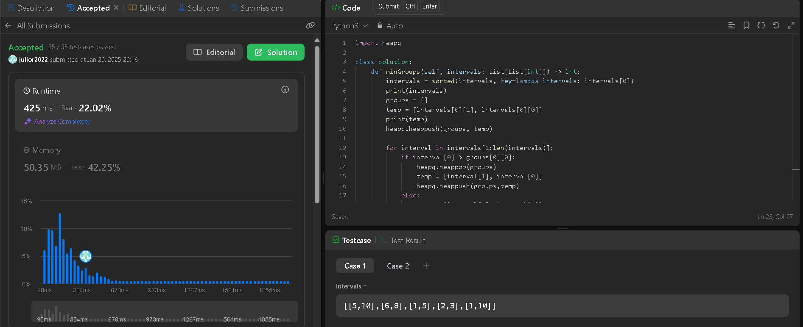
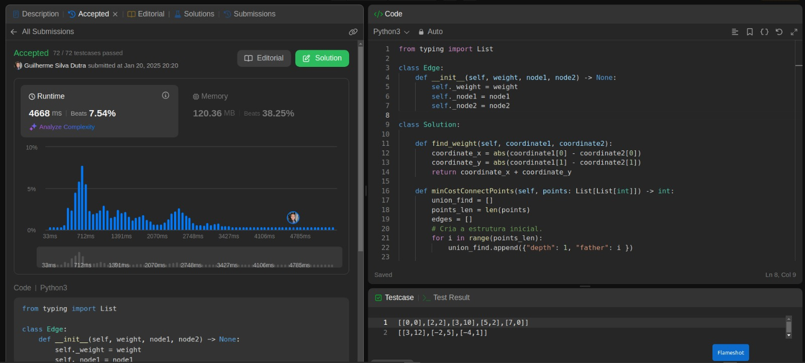
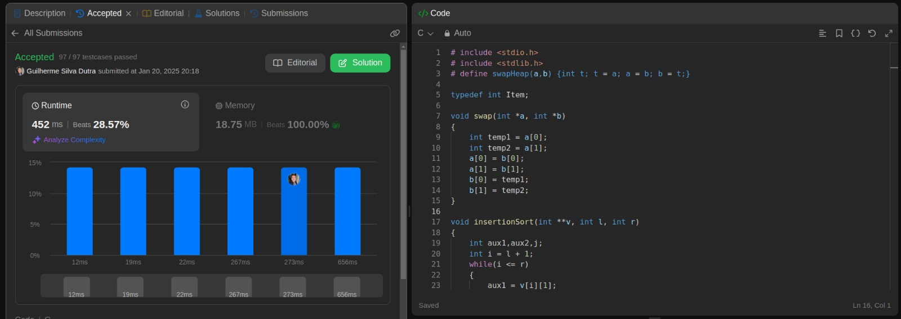
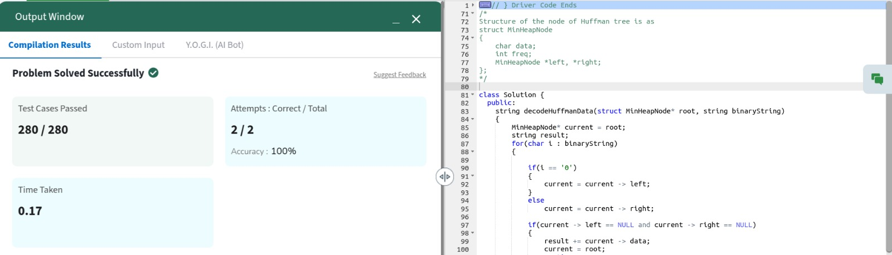

# Greed_FlaFogo

**Número da Lista**: 65 
**Conteúdo da Disciplina**: Algoritmos Ambiciosos 

## Alunos
|Matrícula | Aluno |
| -- | -- |
| 221022041  | Júlio Roberto da Silva Neto |
| 221021984  | Guilherme Silva Dutra|

## Sobre 
Resolução de questões disponíveis na plataforma LeetCode e GeekforGeeks, contemplando exercícios de níveis médio e difícil de dificuldade. O objetivo é abordar o conteúdo lecionado em sala de aula de forma simples e intuitiva, com códigos legiveis e de fácil compreensão.

## Link da Gravação

https://youtu.be/nw7ym9Cefwo

## Questões

| Numeração | Exercício |  Dificuldade |
| ---- | ----- | ---- |
| 2406 | [Divide Intervals Into Minimum Number of Groups](https://leetcode.com/problems/divide-intervals-into-minimum-number-of-groups/description/) | Médio |
| 1584 | [Min Cost to Connect All Points](https://leetcode.com/problems/min-cost-to-connect-all-points/description/) | Médio|
| 630 | [ Course Schedule III ](https://leetcode.com/problems/course-schedule-iii/description/) | Díficil |
| Sem numeração | [HuffmanDecoding](https://www.geeksforgeeks.org/problems/huffman-decoding/1) | Difícil |

## Screenshots

### Divide Intervals Into Minimum Number of Groups

### Min Cost to Connect All Points

### Course Schedule III 

### huffmanDecoding

## Instalação 
**Linguagem**: Python3, C++, C

